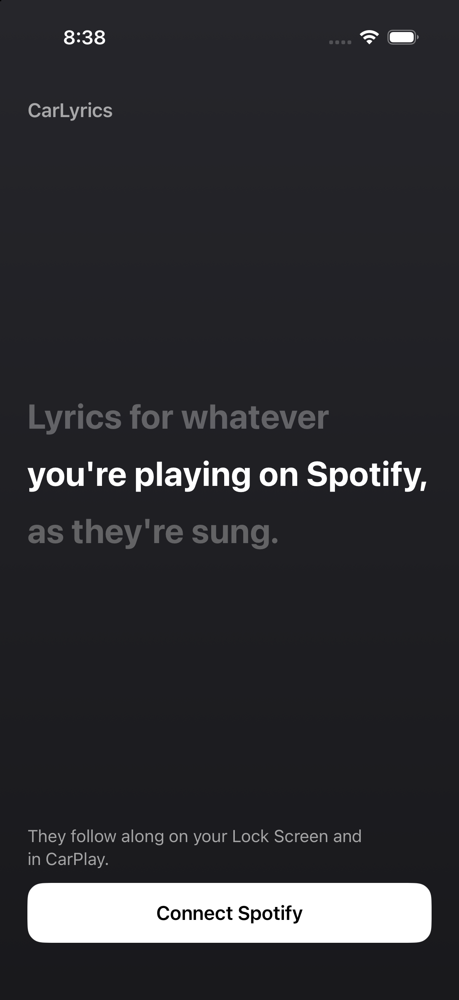

# CarLyrics

An iPhone app that shows synced lyrics for whatever you're playing on Spotify. In the app, the
current line lights up, either all at once or word by word. In CarPlay and on the Lock Screen,
a widget and a Live Activity card show the line being sung and the one after it.

I built it because the app I was using started charging for the real-time lyrics widget.



## How it works

- **Spotify.** You log in once (Authorization Code with PKCE, so there's no client secret on the
  phone). The app asks Spotify's Web API what's playing every 2 seconds and fills in the
  position between checks.
- **Lyrics.** Lyrics come from [LRCLIB](https://lrclib.net), which is free and needs no API key.
  Most songs have timestamps for each line. If a song only has plain lyrics, the app spreads
  the lines evenly across the song and says the timing is a guess.
- **Line or word highlighting.** LRCLIB times whole lines, not words. By default the current
  line lights up as a whole. Settings has a word-by-word mode that estimates when each word
  starts from how long it is; it's close enough to sing along to but can drift on long notes.
  The setting applies to the app and the CarPlay card.
- **CarPlay.** A full CarPlay app needs an entitlement Apple only grants to certain kinds of
  apps, so CarLyrics uses the two things iOS 26 shows in CarPlay without one: a Live
  Activity card (the `.small` activity family) and a regular widget. The widget gets the
  whole song's line timings as a WidgetKit timeline, so iOS moves it from line to line on
  schedule even if the app gets suspended. Both use a color sampled from the album art.
- **Background updates.** iOS suspends apps soon after you leave them, which would freeze the
  card. The app plays silent audio mixed with Spotify's (it never interrupts it) so it can
  keep pushing new lines. That's fine for personal use but would not pass App Store review.
- **Starting without opening the app.** iOS only lets an app start a Live Activity from the
  background inside a Shortcuts action, so CarLyrics has **Start Lyrics** and **Stop Lyrics**
  actions meant for "When CarPlay connects/disconnects" automations.

## Requirements

- iPhone on iOS 26 or later (CarPlay Live Activities need 26)
- Xcode 26 or later and [XcodeGen](https://github.com/yonaskolb/XcodeGen) (`brew install xcodegen`)
- A Spotify account and an app on the [Spotify developer dashboard](https://developer.spotify.com/dashboard)
- An Apple developer account. A free one works, but free installs expire after 7 days.

## Setup

1. Create a Spotify app on the developer dashboard. Check **Web API**, and add
   `carlyrics://callback` and `http://127.0.0.1:8888/callback` as redirect URIs.
2. Copy `Config.example.xcconfig` to `Config.xcconfig` and fill in your Apple team ID, a bundle
   ID, and your Spotify client ID. Git ignores `Config.xcconfig`, and the app, widget, and
   `tools/login_on_mac.py` all read from it.
3. In the Spotify dashboard, add your bundle ID under **iOS app bundles** and check **iOS**.
   That lets the login hand off to the Spotify app, so you only tap Agree.
4. Run `xcodegen generate`, open `CarLyrics.xcodeproj`, pick your iPhone, and press Run.
5. Tap **Connect Spotify**, play a song, and turn on **Show in CarPlay**.

### In the car

- **Widget:** on the iPhone, go to Settings > General > CarPlay > your car, and add the
  CarLyrics **Lyrics** widget to the CarPlay widgets.
- **Card:** in the Shortcuts app, make two automations: **CarPlay connects** → *Start Lyrics*,
  and **CarPlay disconnects** → *Stop Lyrics*, both set to **Run Immediately**.

If lyrics show up after the singer, use the timing offset in Settings. Bluetooth audio usually
runs a little behind.

### If Spotify's login page errors on the phone

Spotify's login page sometimes fails inside the app's login sheet with "Oops! Something went
wrong." With the phone plugged into your Mac, run:

```sh
python3 tools/login_on_mac.py <device-udid>                 # UDID from: xcrun devicectl list devices
python3 tools/login_on_mac.py --simulator <simulator-udid>   # for testing in the simulator
```

It logs in through your Mac's browser and copies the login into the app on the phone.

## Sharing it

A web app or PWA can't do this. Only native apps can show Live Activities or anything else in
CarPlay. Without the App Store, the options are:

- **Build it yourself.** Anyone with a Mac can clone this repo and follow the setup above with
  their own Spotify app. This is the easiest option, since every person has their own Spotify
  quota.
- **Ad Hoc builds.** A paid Apple developer account can register up to 100 iPhones a year by
  UDID and send them a signed build.
- **TestFlight.** Up to 100 internal testers skip review. External testers need a beta review,
  and the silent-audio trick may not pass it.

Spotify also limits apps in development mode to a small allowlist of users, which you manage
under **User Management** on the dashboard. Going past that requires Spotify's extended quota
approval.

## Project layout

| Path | What's there |
| --- | --- |
| `CarLyrics/` | The app: Spotify login and API, LRCLIB lookup, sync engine, background keep-alive, UI |
| `CarLyricsWidget/` | The lyrics widget, plus Live Activity views for CarPlay, the Lock Screen, and the Dynamic Island |
| `Shared/` | Types used by both targets: the Live Activity state, word timing, and the song data the widget reads |
| `Config.example.xcconfig` | Template for your personal build settings |
| `tools/` | The Mac login fallback |

Lyrics are provided by [LRCLIB](https://lrclib.net).
